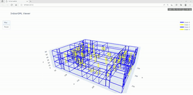
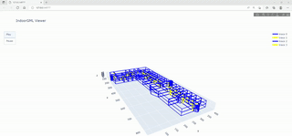
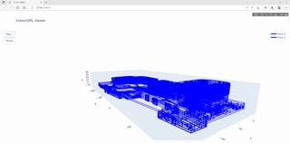

<br />
<p align="center">
  <h3 align="center">IndoorGML Viewer</h3>
  <p align="center">
  </p>
</p>


## Dataset
Input data is from [OGC IndoorGML website](http://www.indoorgml.net/).


## Prerequisites
- Python 3.8+
- Plotly


## Getting Started

- To install the packages type in the console
```
$ pip install -r requirements.txt
```
- To run the program
```
$ python main.py
```

## Visualizion
- Pusan National University Building 201


- Pusan National University Building 313 from the 2nd to 4th floor.


- Lotte World Mall




Copyright (c) 2022 Assankhanov Arman
